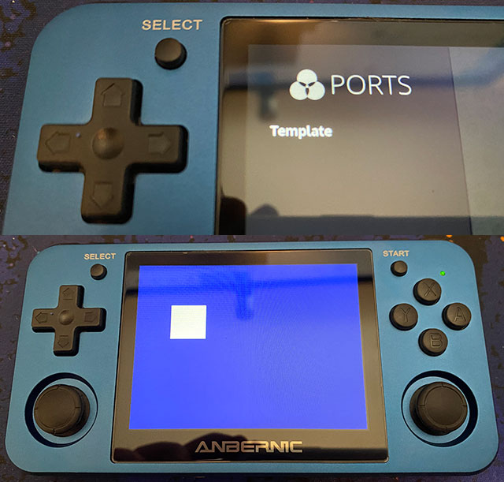

# Development for Anbernic devices using C++ and SDL2

The Anbernic game consoles, when their model number ends in 1, contain a 64-bit ARM (AARCH64) CPU, for example my Anbernic RG351MP has a Rockchip RK3326 clocked at 1.5GHz. Since it runs Linux, it's possible to write software for it that runs natively.

Other devices, like the 350 and 280 series, use a MIPS CPU. The information below may be adjusted to work with MIPS, but I'll concentrate on ARM.

Also, I use Ubuntu x86-64 as my development environment for simplicity.

## Pre-requisites

- An Anbernic or similar device with a 64-bit ARM CPU.
- An OS that's likely not the default one the console comes with. I use JelOS, but AmberElec and several others should work fine too.
- PortMaster must be installed in the OS, because that's how we will select and run the application on the console.
- SDL2 for your developer environment, and also for AARCH64 environments.
- A C++ cross-compiler for AARCH64

## Template - A minimal SDL2 'game' for testing

I wrote a small template that can be used for testing and as the basis of a game. You need to copy the contents of the `ports` directory onto your SD Card's `/roms/ports/` directory to make it show up under the Ports game selector screen. The template shows a square on a blue screen. You can move it around with the D-Pad, and by pressing the A, B, X... etc buttons, it changes to a color associated with the button. The program exits when you press Select and Start together.

I tried to make the source code as simple as possible. When you compile it with #define HANDHELD, the application launches in full screen mode. Otherwise it launches in windowed mode, which is good for development purposes. The build shell files show how to compile it for various environments.

## Installing the Toolchain

*#Install Make and friends, you might need them*

`sudo apt install make automake cmake`

*#Install SDL2 on Ubuntu for development*

`sudo apt install libsdl2-2.0-0 libsdl2-dev libsdl2-doc`

*#Install the GNU C and C++ compilers for X86 32/64-bit*

`sudo apt install gcc g++ binutils`

*#Install the GNU C and C++ compilers for ARM 64-bit*

`sudo apt install gcc-aarch64-linux-gnu g++-aarch64-linux-gnu binutils-aarch64-linux-gnu`

*#Install the GNU C and C++ Version 10 compilers for ARM 64-bit*

`sudo apt install gcc-10-aarch64-linux-gnu g++-10-aarch64-linux-gnu`

## Important note on compilers

As you can see above, I installed both the latest (currently Version 11) and the previous Version 10 of the AARCH64 cross-compiler. During development it turned out that compiling the Template using G++ V11, the application throws an error on launch:

`./template: /usr/lib/libstdc++.so.6: version 'GLIBCXX_3.4.29' not found (required by ./template)`

Long story short, this depends on the C++ compiler the OS itself was compiled with, and JelOS apparently was compiled with G++ V10. In that one, the latest LibC is Version 3.4.28

Therefore it's recommended to cross-compile your applications with GCC / G++ V10, or even V9 if you run into similar library versioning issues in your targeted environment.

## Compiling your application

As you can see in `build-aarch64.sh`, the Template is compiled with G++ V10, it defines the HANDHELD label, and uses a local copy of SDL2 for Includes and for the Library itself. This library file `libSDL2.so` needs to be shipped with your application's executable. If you somehow can static link it into your executable, that may be even better, but it definitely works alongside the application.

I downloaded this AARCH64 version of SDL2 from [archlinuxarm.org (SDL2 package)](https://archlinuxarm.org/packages/aarch64/sdl2). If you're developing for 32-bit ARM, or for MIPS, you will need to download a different package, or cross-compile the SDL2 library for yourself.

## Installing under PortMaster

A working AARCH64 example can be found in the `ports` directory. You need to copy the `Template` directory and the `Template.sh` shell file to your SD Card's `/roms/ports/` directory. The `Template.sh` file sets up some environment variables and launches the executable `template`, when you select it on the user interface.

You may download the port of the game [2048 (zip file)](https://github.com/christianhaitian/PortMaster/blob/main/2048.zip) to inspect how you can launch a customized RetroArch core, if you choose to develop an application or game that way.

## Testing

In JelOS, and presumably in AmberElec too, I can access the file system using Samba and I can log in using SSH. I made the template display some information on the console, if you launch it using SSH, and that's how I caught the LibC version issue I mentioned above. This could be a smart way to figure some things out in the beginning. Once everything works well, you can just keep updating your executable file under `/roms/ports/YOUR-APP/` and as long as it has the AARCH64 version of `libSDL2.so` placed there, it will be fine.

Development both on Linux and on Windows should be relatively easy to do, I'm developing a game on Windows using Visual Studio and cross-compile for ARM on Ubuntu Linux, when on-device testing is needed.
